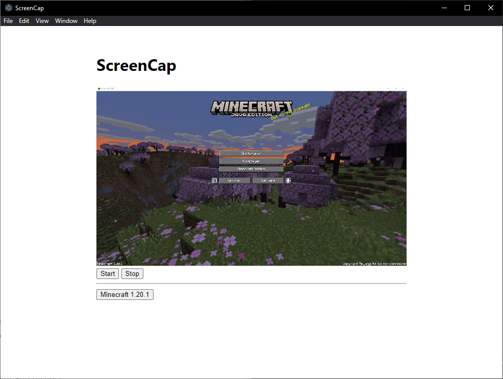

# ScreenCap
A basic screen recording program built with electron.js.
It can record a selected window and audio using web APIs.



Run this command before trying to start or build the application:
```bash
npm update
```

Run this command to start the application:
```bash
npm start
```

Run this command to build the application:
```bash
npm run make
```
